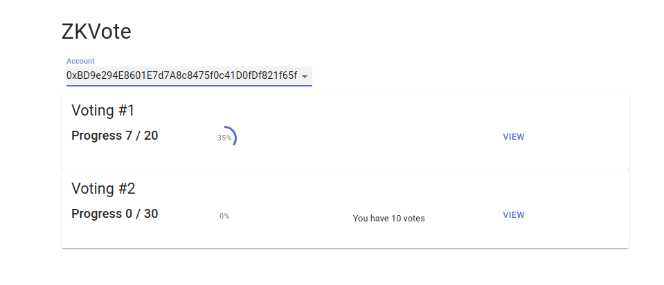
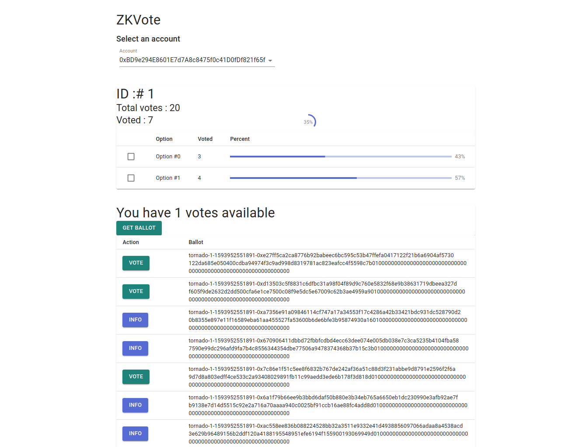
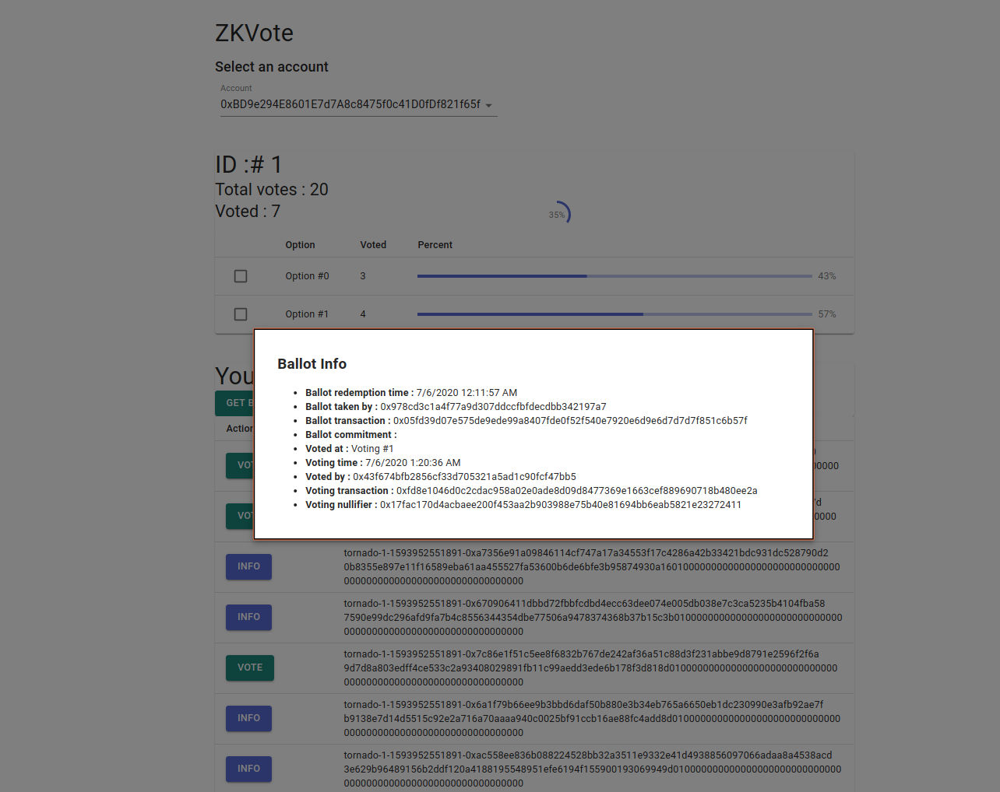

# Tornado Vote Privacy Solution based on Tornado Cash

Tornado Vote is a privacy voting solution based on outstanding [Tornado Cash](https://tornado.cash) that utilizes zkSNARKs. 

## Installation 

Currently, solution is designed and tested for Ganache local testnet. 

Do not forget to start ganache-cli.

Deploy to local network:
```
truffle deploy
````

Test
```
truffle test 
```


## CLI

Please copy .env.exampe to .env 

OWNER_PRIVATE_KEY is a private key for contract owner account. 

PRIVATE_KEY is default private key for user account


### Options
-A \<address> address is ganache account number, ethereum address starting with 0x or word "new" for new address. 0.1 ETH will be sent to new account from OWNER address automatically. 

-r \<rpc> ethereum node host. "http://localhost:8545" is the defualt value


### Commands

#### Intitialization
```
./cli.js setTornado
```
before we start we need to initialize voting comntract to allow Tornado contract managing votes


#### Account information
```
./cli.js accounts
Account #0 Address 0x3a2ACb7D59B441bE9aB3d1f095D59132E39ACd11
Account #1 Address 0x58727631C1D0363f638A63539f9c1fcaeb83b8fE
Account #2 Address 0xc323BbA7183C7C8cB85c7Cb757E5bF5AC5394040
Account #3 Address 0xE5766F90d60115062accAb8A81c37c4A50054ef1
Account #4 Address 0xf21E0A4296f313489f9780464BF5Ee746867Eb85
Account #5 Address 0x9db0A13ADDAB1A7492aC9Fb458eE61e9C50C95C6
Account #6 Address 0x0B744367725607668DC79dB7e55120Ef9f1b967a
Account #7 Address 0x6CeC16897e5d18a6bd72Cd115F60368E643fdfea
Account #8 Address 0x477767F6E5176BDC5f34C15404B4aD83F0e23742
Account #9 Address 0x8B82EBbb158FB24649348eA497eE0F573da85Aba
Active address: 0x58727631C1D0363f638A63539f9c1fcaeb83b8fE

```

#### votingInfo  

./cli.js votingInfo \<votingId> 


Displays voting information


#### createVoting 

./cli.js createVoting \<optionsCounter> \<nomination> 

Creates voting

optionsCounter number of voting options

nomination value of one ballot

```
./cli.js createVoting 3 1
Voting created. ID :  4
./cli.js votingInfo 4
Getting voting info. ID :  4

=============Voting=================
Creator               : 0x3a2ACb7D59B441bE9aB3d1f095D59132E39ACd11
Number of options     : 3
Nomination            : 1
Total votes           : 0
=============Options================
Option 0 votes        : 0
Option 1 votes        : 0
Option 2 votes        : 0
====================================
```
This sample create voting with three options, each ballot adds 1 vote to chosen option


#### getVotes

./cli.js getVotes \<votingId>

Getting number of votes available for address


#### addVotes 

./cli.js addVotes \<votingId> \<votesNumber>


Add votes to specified address. Transaction is performed by OWNER

```
./cli.js -A 5 addVotes 4 10
Using account  0x9db0A13ADDAB1A7492aC9Fb458eE61e9C50C95C6

./cli.js votingInfo 4
Getting voting info. ID :  4

=============Voting=================
Creator               : 0x3a2ACb7D59B441bE9aB3d1f095D59132E39ACd11
Number of options     : 3
Nomination            : 1
Total votes           : 10
=============Options================
Option 0 votes        : 0
Option 1 votes        : 0
Option 2 votes        : 0
====================================

./cli.js -A 5 getVotes 4
Using account  0x9db0A13ADDAB1A7492aC9Fb458eE61e9C50C95C6
Available votes 10

```
This sample adds 10 votes to account #5


#### ballot \<votingId>

./cli.js ballot \<votingId>


Converts votes to ballot 

```
./cli.js -A 5 ballot 4
Your ballot: tornado-4-1592692982076-0x6b3afc57725b0729801669e8fb609d27905af85b389e5bb587bb41991934a7cebbd978d076f9f091be46018c9a8017be2f1e5e283ad4386f810d13584a3904000000000000000000000000000000000000000000000000000000000000
Submitting deposit transaction
The transaction hash is 0x635993c940f986497bc44e5e2a1a92fccd44f3a2ce1fc9bc4dd9c3561034b30b
./cli.js -A 5 getVotes 4
Using account  0x9db0A13ADDAB1A7492aC9Fb458eE61e9C50C95C6
Available votes 9
```

Account #5 withdraws ballot that is: 

``` 
tornado-4-1592692982076-0x6b3afc57725b0729801669e8fb609d27905af85b389e5bb587bb41991934a7cebbd978d076f9f091be46018c9a8017be2f1e5e283ad4386f810d13584a3904000000000000000000000000000000000000000000000000000000000000
```

### vote 

./cli.js vote \<ballot> \<option>

Use the ballot with selected option 


```
./cli.js -A new vote tornado-4-1592692982076-0x6b3afc57725b0729801669e8fb609d27905af85b389e5bb587bb41991934a7cebbd978d076f9f091be46018c9a8017be2f1e5e283ad4386f810d13584a3904000000000000000000000000000000000000000000000000000000000000 2
Using account  0x06c03CF282b0cB9F223222bf92dEe95ea8Ce3A0d
using private key 4
Getting current state from tornado contract
Generating SNARK proof
Proof time: 6330.094ms
Submitting withdraw transaction 2
The transaction hash is 0xca8644097f065e42d0a1f9505dc1041a331c48e9eeaa2384efa7052a8d172aeb
Done
```
New account votes with ballot in voting 4 for option 2
```
Getting voting info. ID :  4

=============Voting=================
Creator               : 0x3a2ACb7D59B441bE9aB3d1f095D59132E39ACd11
Number of options     : 3
Nomination            : 1
Total votes           : 20
=============Options================
Option 0 votes        : 0
Option 1 votes        : 0
Option 2 votes        : 1
====================================
```

#### compliance

./cli.js compliance \<ballot>

displays the ballot information 

```
./cli.js compliance tornado-4-1592692982076-0x6b3afc57725b0729801669e8fb609d27905af85b389e5bb587bb41991934a7cebbd978d076f9f091be46018c9a8017be2f1e5e283ad4386f810d13584a3904000000000000000000000000000000000000000000000000000000000000 

=============Ballot==================
Deposit     : undefined undefined
Date        : 6/22/2020 7:14:44 PM
From        : 0x9db0a13addab1a7492ac9fb458ee61e9c50c95c6
Transaction : 0x635993c940f986497bc44e5e2a1a92fccd44f3a2ce1fc9bc4dd9c3561034b30b
Commitment  : 0x20f863c511daa535f605e62200ed24d36e81141d613e30dba440156c57e26201

=============Vote====================
VotingId    : 4
Date        : 6/22/2020 7:18:48 PM
From        : 0x06c03cf282b0cb9f223222bf92dee95ea8ce3a0d
Transaction : 0xca8644097f065e42d0a1f9505dc1041a331c48e9eeaa2384efa7052a8d172aeb
Nullifier   : 0x002a01d05f87ffd7f42f7a462ff77a3089e764441934e525ccd22afd84003d1b

=====================================
```

## Frontend

Frontend development is in progress and is available at Please visit [Frontend for ZK Vote](https://github.com/koinov/zkvote-front) for more details


### Current votings list :



### Voting information :



### Ballot information :




## TODO:


[ ] Voting end date

[ ] Simplyfying ballot structure

[ ] Automatic withdrawal all available ballots through CLI

[ ] Automatic, randomly delayed voting for all available ballots through CLI

[ ] Proxy for gasless voting through third-party server

[ ] Ethereum faucet server for valid ballot owners. In mainnet you can always use [Tornado Cash](https://tornado.cash) to get clean Ethereum for voting gas. 

[X] Front End (in progress) 

[ ] Contract for ERC-20 token based voting, with freezing balances during voting period

[ ] Thiking of staking for frozen tokens


## Credits

Special thanks to Roman Storm for awesome Tornado.cash!

[Tornado.Cash Website](https://tornado.cash)

[Tornado.Cash Github](https://github.com/tornadocash) 


